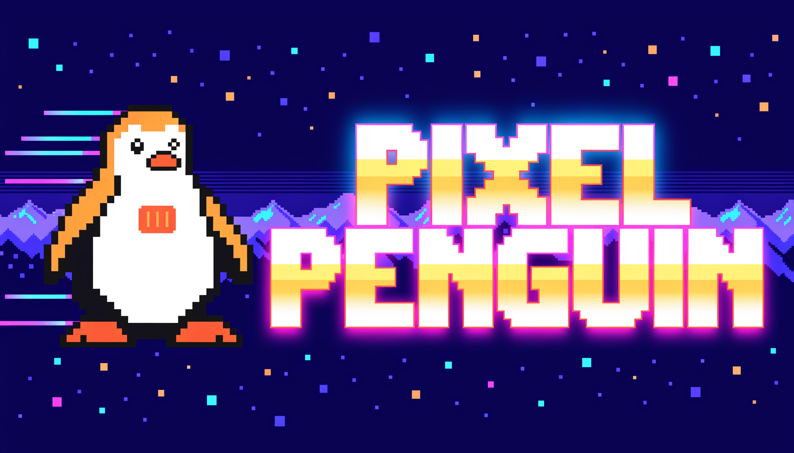

# Hi, I'm Gerrit 🐧

**Part of [Pixel Penguin](https://pixel-penguin.com) — a software studio that builds digital experiences.**
We craft web & mobile applications for businesses across Southern Africa and beyond.

---

### 🛠️ What I build

- 🌐 Full-stack **web & mobile apps** — from idea to ship
- ☁️ **Cloud infrastructure & DevOps** on AWS
- 🤖 **AI integration** baked into real products
- 🛒 E-commerce, project management & healthcare platforms

### ⚡ How I work

- 🧼 Clean, maintainable code
- 🚀 Ship fast, iterate often
- 🔍 Care about the details

### 🧰 Tech I reach for

### 🤝 Let's build something

- 🏢 Studio: **[@PixelPenguinAI](https://github.com/PixelPenguinAI)**
- 🌍 Web: **[pixel-penguin.com](https://pixel-penguin.com)**
- ✉️ **hello@pixel-penguin.com**

*🐧 Clean code. Shipped fast. Built to last.*

